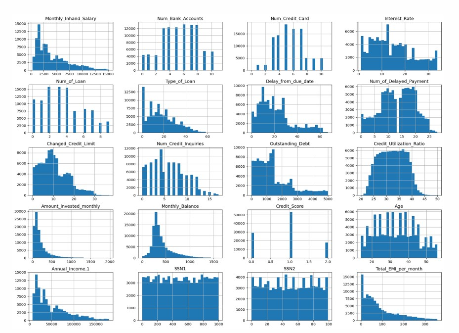
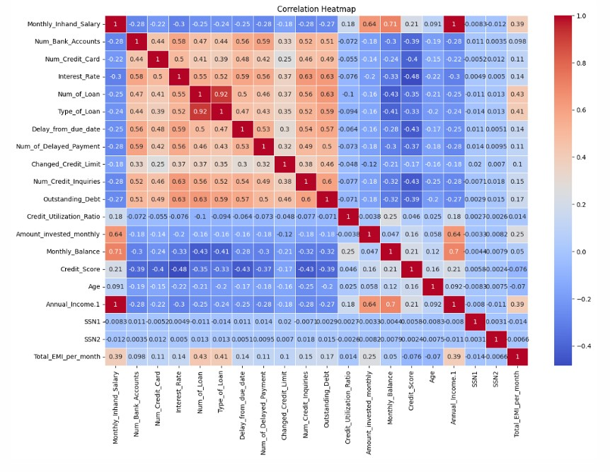
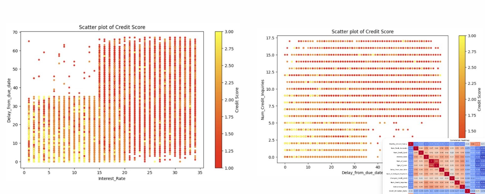
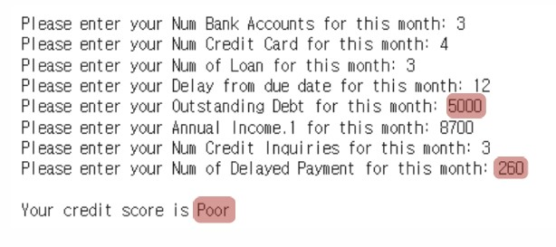

2024년 여름에 미국 LA에 있는 USC에서 진행했던 팀 프로젝트입니다. python을 사용했으며, jypter를 통해 진행했습니다. 데이터 전처리, 데이터 시각화, 모델링 과정으로 이루어져 있습니다.

<!--more-->

각 개인 정보와 재무 상태가 포함되어 있는 '신용 점수' 데이터를 kaggle 사이트에서 다운 받아 사용하였습니다. 데이터 set은 10만 개의 행과 28개의 열로 구성되어 있었습니다.

<Data Cleaning & Imputing Missing Values>
1. 처음에는 쓰레기 값(가비지값 예시 + 코드 캡쳐 보여주기)을 교체하는 것부터 시작했습니다. 예를 들어, 불필요한 강조 표시 또는 무의미한 값이 있습니다. 그래서 이러한 값을 결측값으로 대체했습니다. 또한 이름 및 고객 ID와 같이 민감한 개인 정보를 가진 일부 변수와 다른 독립 변수의 상관관계가 높거나 쓸모없는 변수들은 데이터 셋에서 제거되었습니다. 이를 통해 다중 공선성 문제를 완화할 수 있습니다. 그리고 일부 수치 변수의 이상값은 IQR 방법에 따라 결측값으로 대체되었습니다.
2. 결측값에 대해서는 귀책 방법을 사용했습니다. 변수의 특성에 따라 고정 변수에는 최빈값을, 고객별로 유연한 변수에는 평균을 사용했습니다.
예를 들어, "연령" 열에서 결측값은 모든 사람이 1년에 같은 연령, 즉 고정 변수를 가지고 있기 때문에 최빈값으로 채워졌습니다.
3. 몇 가지 변수를 생성했습니다. SSN은 사회보장번호로, 첫 세 자리 숫자는 지역을, 가운데 두 자리 숫자는 내국인 또는 외국인과 같은 그룹을 나타냅니다. 그래서 이 숫자를 나누어 별도로 새로운 변수로 사용했습니다.
또 다른 변수는 대출 유형입니다. 처음에는 이 변수에 해당하는 값들로 "주택담보대출", "학자금대출", "개인대출" 등이 있었는데(문자열), "AND"로 연결되어 있었습니다. 여기서 "AND"를 제거하고 유형을 나누었습니다. 그런 다음 가중치와 같이 중요도에 따라 각 유형에 대한 레이블을 설정했습니다. 그리고 총합을 계산하여 대출의 위험을 나타내는 새로운 변수로 만들었습니다.

<Data Visualization>

<Data Modeling>
__사용한 모델들__
- Logistic Regression
- SVC
- Random Forest
- Confustion Matrix
