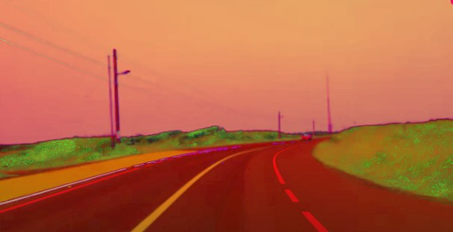
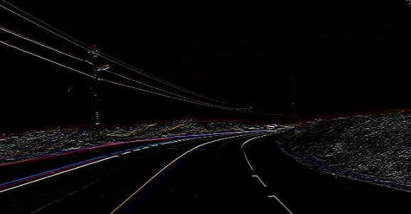
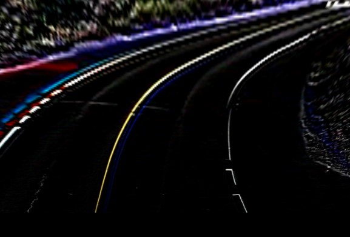
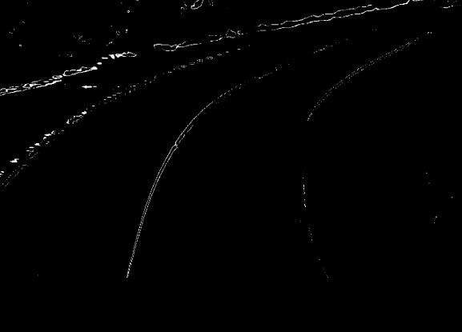
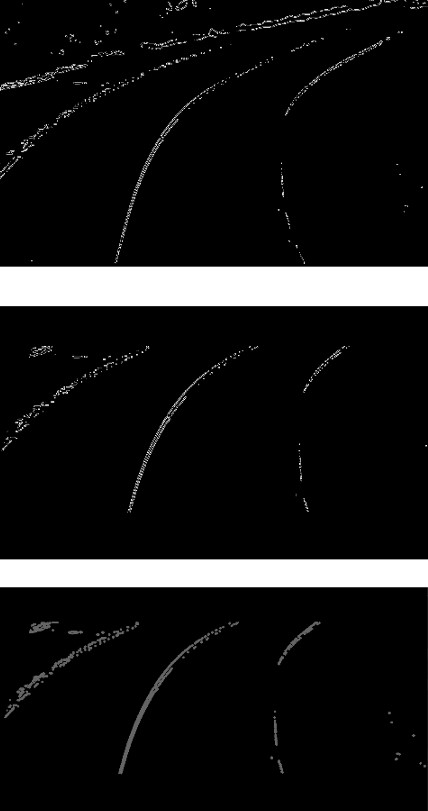
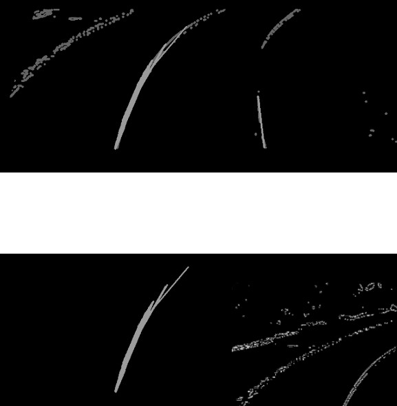
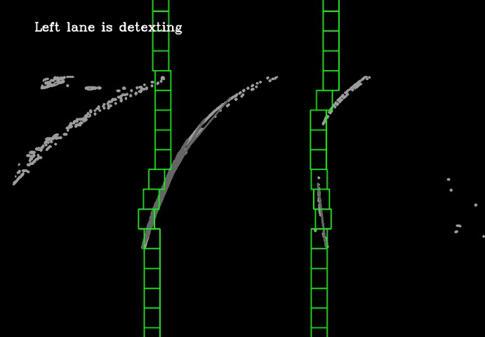
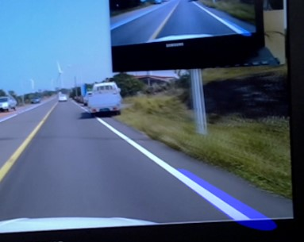

2024학년 여름에 전북대학교에서 일주일 간했던 차량 자율주행을 위한 임베디드 교육 중에 했던 원 데이 팀 프로젝트입니다. 이미지로 먼저 전처리 과정과 차선 감지를 해보고, 영상을 이용해 프로젝트를 수행했습니다.

<!--more-->

<프로젝트 진행 과정>

- numpy와 cv2 라이브러리를 통해 진행되었습니다.

1. 입력된 이미지나 영상을 먼저 HSV 색상으로 변환하여 특정 색상 범위를 더 쉽게 감지할 수 있게 합니다.

2. Sobel 연산을 통해 이미지에서 경계를 검출합니다.

3. 도로의 시점을 Bird's Eye View로 변환합니다. 이때 Bird's Eye View는 위에서 내려다보는 시점을 뜻합니다.

4. 이미지에서 특정 색상 범위를 기반으로 흰색과 노란색 차선을 검출합니다.

5. Canny 엣지 검출기를 사용하여 경계를 더욱 명확히 검출합니다. 관심 영역(ROI)을 설정하여 불필요한 부분을 마스킹합니다.

6. Hough 변환을 통해 이미지, 영상에서 직선을 검출합니다. 이때 직선은 차선으로 인식됩니다.

7. 윈도우 슬라이딩과 다항식 피팅을 거쳐 차선의 곡률을 모델링 합니다.

8. 마지막으로 검출된 차선을 원래 시점으로 다시 변환하여, 원본 이미지와 합성을 통해 최종적으로 시각화합니다.
