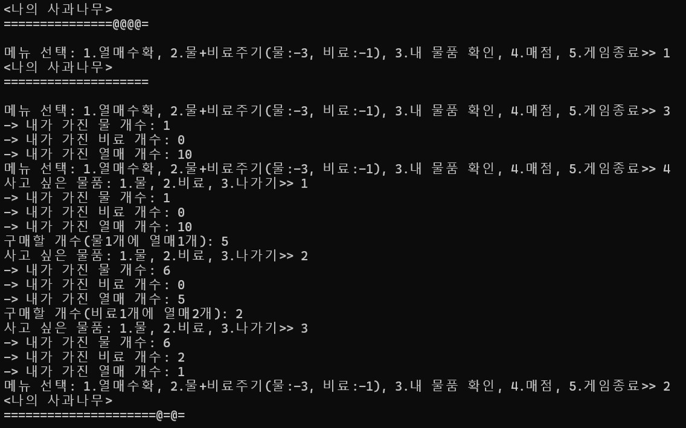
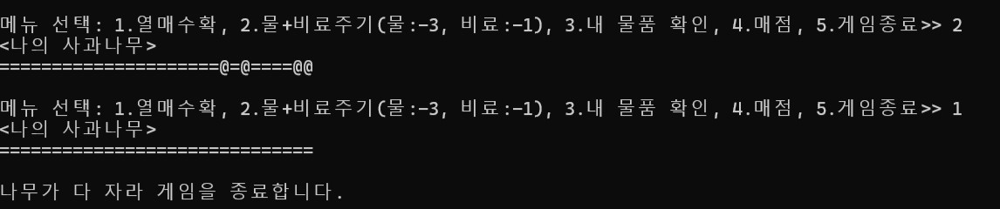

2023년 여름에 C++프로그래밍 수업에서 했던 개인 프로젝트입니다. 랜덤으로 생기는 과일을 수확하여 나무를 끝까지 키우면 승리, 나무에 키우는 데 필요한 요소들이 일정 조건보다 적거나, 게임 패배의 일정 조건을 만족시키면 패배하는 게임입니다.

<!--more-->

- 게임 방법: 처음에 키울 나무 종류를 선정(과일 모양 결정)하면, 씨앗을 뿌린다는 메시지를 띄우고 처음 상태인 줄기 5개(“=====”)인 나무 객체를 생성한다.
나무 객체가 생성되면 할 일을 메뉴에서 선택할 수 있다.

1. 물+비료 주기 -> 물과 비료를 3:1로 소모하여 과일이 나무에 열리게 한다. 물과 비료가 필요한 만큼 존재하지 않으면 해당 요소의 부족함을 알린다. 랜덤으로 열릴 열매 개수를 선정한다. for문을 이용해서 해당 열매 기호를 문자열 뒤에 추가한다. 이때, 열매의 위치도 랜덤으로 설정하기 위해서, 0 또는 1을 랜덤으로 결정한다. 1이 나왔을 경우, 결정된 열릴 열매 개수가 0보다 크다면 선택한 나무의 열매 기호가 추가되게 한다. 그 외 경우에는 줄기(“=”)가 추가되게 한다.

2. 열매 수확 -> 문자열 길이만큼 for문을 반복할 때, 문자열에서 과일 기호를 찾아 줄기로 변경해주고 변경한 횟수만큼 내가 가진 과일의 개수를 1개씩 증가시킨다. 나무의 줄기가 30개가 되면 다 자란 상태로 인식해 게임을 종료한다. 또한 나무를 키우는데 필요한 요소들이 나무를 키울 수 없는 조건에 해당하면 게임을 종료한다.

3. 내 물품 확인 -> 현재 가지고 있는 물의 개수, 비료의 개수, 열매의 개수를 확인한다.

4. 매점 -> 나무를 키우는데 필요한 물과 비료를 수확한 열매를 통해 구매할 수 있다.

5. 게임 종료 -> 게임 하는 도중에 종료하고 싶을 때 종료할 수 있다.